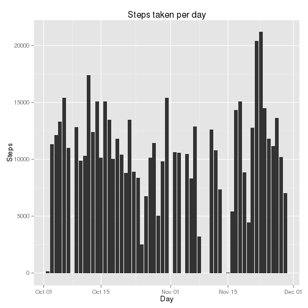
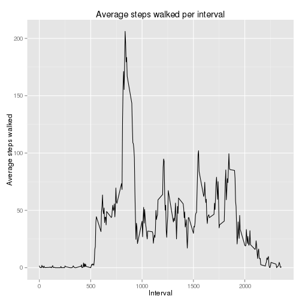
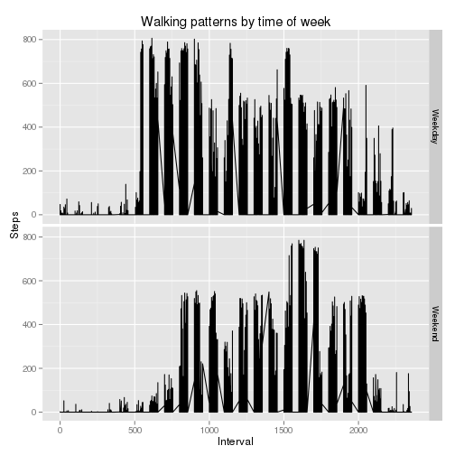

# Reproducible Research: Peer Assessment 1

## Setup required packages

```r
if ("ggplot2" %in% rownames(installed.packages()) == FALSE) {
    install.packages("ggplot2")
}
library(ggplot2)
```


## Loading and preprocessing the data

```r
library(ggplot2)
unzip("activity.zip")
activityData <- read.csv("activity.csv", stringsAsFactors = F)
activityData$date <- as.Date(activityData$date)
cleanActivityData <- activityData[!is.na(activityData$steps), ]
```


## What is mean total number of steps taken per day?

```r
sums <- aggregate(cleanActivityData$steps, list(cleanActivityData$date), sum)
names(sums) <- c("date", "steps")
ggplot(sums, aes(date, steps)) + geom_histogram(stat = "identity") + ggtitle("Steps taken per day") + 
    xlab("Day") + ylab("Steps")
```

 

```r

# Average total steps per day - original data
mean(sums$steps)
```

```
## [1] 10766
```

```r

# Median total steps per day - original data
median(sums$steps)
```

```
## [1] 10765
```


## What is the average daily activity pattern?

```r
averages <- aggregate(cleanActivityData$steps, list(cleanActivityData$interval), 
    mean)
names(averages) <- c("interval", "interval.average")

ggplot(averages, aes(x = interval, y = interval.average)) + geom_line() + xlab("Interval") + 
    ylab("Average steps walked") + ggtitle("Average steps walked per interval")
```

 

```r

# Interval with highest average steps
averages[averages$interval.average == max(averages$interval.average), "interval"]
```

```
## [1] 835
```


## Imputing missing values
### Imputation strategy - Replace NA values with average steps taken during interval across all days.

```r
# Merges average steps per interval (computed earlier) into source data
activityData <- merge(activityData, averages, by = "interval")

# Changes NA values to average steps per interval
activityData$steps[is.na(activityData$steps)] <- activityData$interval.average[is.na(activityData$steps)]

sums <- aggregate(activityData$steps, list(activityData$date), sum)
names(sums) <- c("date", "steps")

# Average total steps per day - imputed data
mean(sums$steps)
```

```
## [1] 10766
```

```r

# Median total steps per day - imputed data
median(sums$steps)
```

```
## [1] 10766
```


## Are there differences in activity patterns between weekdays and weekends?

```r
activityData$day <- weekdays(activityData$date)
activityData$day[activityData$day %in% c("Saturday", "Sunday")] <- "Weekend"
activityData$day[activityData$day != "Weekend"] <- "Weekday"
activityData$day <- factor(activityData$day)

ggplot(activityData, aes(x = interval, y = steps)) + geom_line() + facet_grid(day ~ 
    .) + xlab("Interval") + ylab("Steps") + ggtitle("Walking patterns by time of week")
```

 

